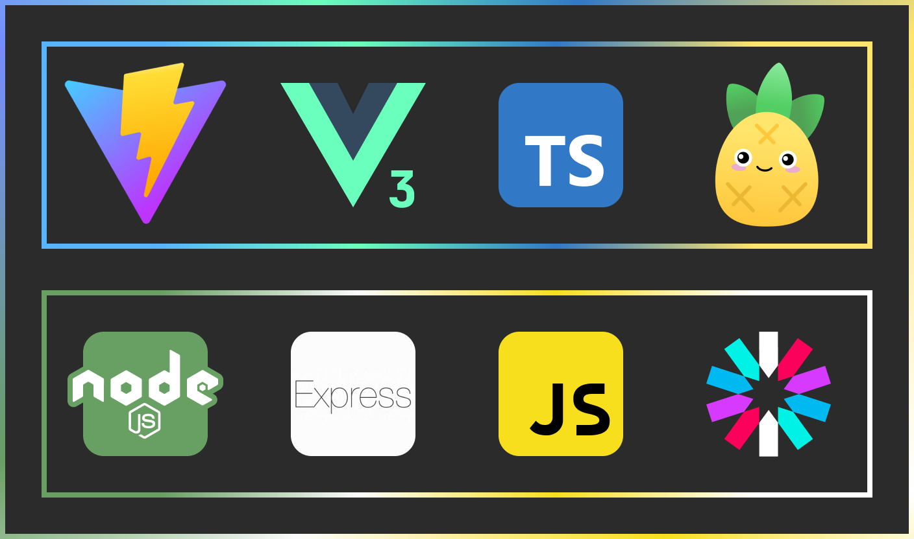

# JWT Authorization Project

#### Front-End Stack:
* [Vite](https://vitejs.dev/)
* [Vue](https://vuejs.org/)
* [TypeScript](https://www.typescriptlang.org/)
* [Pinia](https://pinia.vuejs.org/)
* [sass](https://sass-lang.com/)

#### Back-End Stack:
* [NodeJS](https://nodejs.org/en/)
* [Express](https://expressjs.com/)
* [JavaScript](https://developer.mozilla.org/en-US/docs/Web/JavaScript)
* [JWT](https://jwt.io/)

#### DataBase: [MongoDB](https://www.mongodb.com/)

